<div align="center">

<br>


<br>


</div>


I'm **Omar**, and online I go by **Mitaro**. I study computer science at **MTUCI** and I write mostly `Python` and `Flask`, with plain `JavaScript` on the front end.

The projects below lean on one idea: **local-first**. Two of them keep your files on your own machine, and none of them needs a cloud service in the middle. That's why I reach for `SQLite` and the local disk before I reach for someone else's servers.

Right now I'm getting better at backend architecture and at the security side of things: encryption, hashing, how to store a password properly. On the side I'm prototyping a personal AI assistant in the spirit of Jarvis, mostly to see how far I can push it.

Outside of code I train hand-to-hand combat. The habit of keeping a cold head under pressure carries over to debugging.

<br clear="left">

<div align="center">

<a href="https://t.me/treadways"></a>
<a href="mailto:miri.saro@bk.ru"></a>
<a href="https://instagram.com/stere.os"></a>

</div>

> [!CAUTION]
> Working product beats endless planning. Readable code beats clever code. Anything that touches user data gets security from day one.

<div align="center">


<br>
<a href="https://github.com/mitaro-cs/VantaVault"></a>

</div>

<details>
<summary><b>How to run VantaVault</b></summary>

```bash
git clone https://github.com/mitaro-cs/VantaVault.git
cd VantaVault
chmod +x main && ./main      # macOS / Linux
.\main.ps1                   # Windows (PowerShell), or open main.bat
```

</details>

<div align="center">

<a href="https://github.com/mitaro-cs/AetherCloud"></a>

</div>

<details>
<summary><b>How to run AetherCloud</b></summary>

```bash
git clone https://github.com/mitaro-cs/AetherCloud.git
cd AetherCloud
python3 -m venv .venv && source .venv/bin/activate
pip install -r requirements.txt
python AetherCloud.py        # then open http://127.0.0.1:5000

# or with Docker
cp .env.example .env && docker compose up -d
```

How it fits together: `Client / PWA` → `Flask routes and templates` → `SQLite metadata` → `local disk or a mounted volume`.

</details>

<div align="center">

<a href="https://github.com/mitaro-cs/KworkingSystem"></a>

</div>

<details>
<summary><b>How to run Campus Coworking</b></summary>

```bash
git clone https://github.com/mitaro-cs/KworkingSystem.git
cd KworkingSystem
./start_macos.command        # Windows: start_windows.bat
```

The start file creates a virtual environment, installs `requirements.txt`, opens the browser and serves the app on `http://127.0.0.1:5000`. Set `PORT=8000` to change the port.

</details>

Also in my repositories: [Mouros](https://github.com/mitaro-cs/Mouros) is my Python practice archive, and [Java](https://github.com/mitaro-cs/Java) and [Python](https://github.com/mitaro-cs/Python) hold the first steps in each language.

<div align="center">

<br>

<sub>Every frame is a real commit from my repositories, unedited. The strip updates itself.</sub>

<br>

<br>

<br>

<br>

<br>

<br>

<sub>A pixel-art sketch of the layout with sample data. The real vault is private.</sub>

</div>

Obsidian is where everything that is not code lives: lecture notes, reading, a journal and a map of my projects. The vault is called **Equilibrium**: about 600 notes in 11 folders, versioned in Git.

Its home page is a dashboard I built myself. It is a single [Datacore](https://github.com/blacksmithgu/datacore) block written in JSX that asks the vault one question and draws everything from the answer. Paths, links and labels live in one config note instead of the code, so the dashboard keeps working when I rename a folder. The look is a separate CSS snippet of about 1,400 lines with a strict black-and-white system: matte panels, thin lines, no glow. It takes its colors from the active theme, so light and dark mode both work, and there is a layout for the phone too.

| Widget | What it does |
| --- | --- |
| **Header** | A sticker with the day of the year as a progress meter |
| **Clock** | A live clock; only this component re-renders every second |
| **Dot calendar** | One dot per day of the month, days with lecture notes light up, today is inverted |
| **Study** | Every subject folder with its note count and a check mark if I wrote something this week |
| **Recent** | The latest lecture, practice and lab notes, tagged LEC, PRA or LAB |
| **Watching** | Posters of what I am watching with season and episode badges, loaded only when they scroll into view |
| **Stats** | Notes, edits in the last seven days, films and series, counted straight from the vault |
| **Links** | Quick pills to the planner, the cinema shelf and the rest of the vault |

Around the dashboard: **Bases** for the film and series shelves, **Kanban**, **Calendar**, **Excalidraw** for diagrams, and a vault map note with the tag dictionary, my rules for notes and a set of ready-made queries.

<div align="center">

<br>

<br>


</div>

- Building **Flask** backends with cleaner structure
- Studying **security**: encryption, hashing, local-first design
- Prototyping a personal **AI assistant**, Jarvis-style
- Studying computer science at **MTUCI**

<div align="center">


</div>
