<h2 align="center">Салам 👋 I'm Omar · Mitaro</h2>

❄️ CS student at <b>MTUCI</b> building small but complete products: private tools, web apps, automation, and cold dark interfaces. My path is engineering code, architecture, UX, and security as <b>one system</b> — local-first, reliable, and free of visual noise.

&nbsp;

 

## ❄️ About Me

<table>
  <tr>
    <td width="55%" valign="top">
       
      🧊 &nbsp;Currently sharpening my <b>Python & Flask</b> backend skills  
      🏔 &nbsp;Building <b>private tools</b>: encrypted vaults & self-hosted clouds  
      🖥 &nbsp;Designing <b>cold dark UIs</b> — minimal, functional, quiet  
      🔐 &nbsp;Learning <b>security</b>: encryption, hashing, local-first thinking  
      🤖 &nbsp;Working on a personal <b>AI assistant</b> inspired by Jarvis  
      🥋 &nbsp;Discipline from <b>hand-to-hand combat</b> — cold mind under pressure  
      ⚡ &nbsp;I only like <b>systems that hold</b>.
        
    </td>
    <td width="45%" valign="top">
      
    </td>
  </tr>
</table>

## 🔗 Connect Me

 

&nbsp;

&nbsp;

&nbsp;

 

## 📊 GitHub Status

 

 
 

 

## 🧰 Languages & Tools I Have Placed My Hands On

 

 

 
 

## ⭐ Best Repositories

<table>
  <tr>
    <td width="50%" valign="top">
       
      <h3>📦 <a href="https://github.com/mitaro-cs/VantaVault">VantaVault</a></h3>
      
Personal encrypted vault for external drives. Privacy-first local storage: password access, AES flow, PBKDF2-SHA256, brute-force lockout.

      

        
        
      

    </td>
    <td width="50%" valign="top">
       
      <h3>📦 <a href="https://github.com/mitaro-cs/AetherCloud">AetherCloud</a></h3>
      
Self-hosted private cloud on your own disk. Dark dashboard, nested folders, previews, storage quotas, installable PWA, Docker direction.

      

        
        
      

    </td>
  </tr>
  <tr>
    <td width="50%" valign="top">
       
      <h3>📦 <a href="https://github.com/mitaro-cs/KworkingSystem">KworkingSystem</a></h3>
      
Digital campus coworking app: workspace booking, check-in by ID, Pomodoro 25/5, profiles, session authentication.

      

        
        
      

    </td>
    <td width="50%" valign="top">
       
      <h3>📦 <a href="https://github.com/mitaro-cs/Mouros">Mouros</a></h3>
      
Python learning archive & CS practice base — the structured foundation of my developer path, version-controlled from day one.

      

        
        
      

    </td>
  </tr>
</table>

## 🛠 Tech Stack

 

 

## 🧭 Principles

 

`working product > endless planning` &nbsp;·&nbsp; `readable code > clever tricks`

`simple interface > visual noise` &nbsp;·&nbsp; `local-first > cloud dependency`

`security from day one` &nbsp;·&nbsp; `small daily progress > perfect conditions`

 

