<div align="center">


<br>


<br>


</div>

I'm **Omar**, and online I go by **Mitaro**. I study computer science at **MTUCI**. I started with `Python` and `Flask`, and lately I also write `Java` with Spring Boot and `Svelte` for bigger projects.

The projects below lean on one idea: **local-first**. In all four the data stays on a machine you control instead of a cloud service in the middle. That's why I reach for `SQLite` and the local disk before I reach for someone else's servers.

Right now I'm getting better at backend architecture and at the security side of things: encryption, hashing, how to store a password properly. On the side I'm prototyping a personal AI assistant in the spirit of Jarvis, mostly to see how far I can push it.

Outside of code I train hand-to-hand combat. The habit of keeping a cold head under pressure carries over to debugging.

<div align="center">

<a href="https://t.me/treadways"></a>
<a href="mailto:miri.saro@bk.ru"></a>
<a href="https://instagram.com/stere.os"></a>

</div>

<div align="center">



</div>

<div align="center">


<br>
<a href="https://github.com/mitaro-cs/StorageSystem"></a>

</div>

<details>
<summary><b>How to run groupbase</b></summary>

Download the installer from the [latest release](https://github.com/mitaro-cs/StorageSystem/releases/latest): `windows-setup.exe` for Windows 10 and 11, `macos-apple-silicon.dmg` or `macos-intel.dmg` for a Mac.

1. Install it. On macOS drag it to Applications; if the system cannot verify the developer, use System Settings → Privacy & Security → Open Anyway. On Windows choose More info → Run anyway. No admin rights needed.
2. On the first launch enter the group name, your name and a password. You become the site admin and the group leader.
3. Open Settings → Server → Internet, sign in to the free tunnel and press "Open access" to get a permanent link and a QR code for the group.

Or build it yourself (JDK 21+ and Node.js 22+):

```bash
git clone https://github.com/mitaro-cs/StorageSystem.git groupbase
cd groupbase
make build
java -jar target/groupbase.jar serve
```

How it fits together: `Tauri host app` → `Spring Boot server` → `SQLite`; every phone keeps its own copy of the data and syncs when the host computer is back on.

</details>

<div align="center">

<a href="https://github.com/mitaro-cs/VantaVault"></a>

</div>

<details>
<summary><b>How to run VantaVault</b></summary>

```bash
git clone https://github.com/mitaro-cs/VantaVault.git
cd VantaVault
chmod +x main && ./main      # macOS / Linux
.\main.ps1                   # Windows (PowerShell), or open main.bat
```

</details>

<div align="center">

<a href="https://github.com/mitaro-cs/AetherCloud"></a>

</div>

<details>
<summary><b>How to run AetherCloud</b></summary>

```bash
git clone https://github.com/mitaro-cs/AetherCloud.git
cd AetherCloud
python3 -m venv .venv && source .venv/bin/activate
pip install -r requirements.txt
python AetherCloud.py        # then open http://127.0.0.1:5000

# or with Docker
cp .env.example .env && docker compose up -d
```

How it fits together: `Client / PWA` → `Flask routes and templates` → `SQLite metadata` → `local disk or a mounted volume`.

</details>

<div align="center">

<a href="https://github.com/mitaro-cs/KworkingSystem"></a>

</div>

<details>
<summary><b>How to run Campus Coworking</b></summary>

```bash
git clone https://github.com/mitaro-cs/KworkingSystem.git
cd KworkingSystem
./start_macos.command        # Windows: start_windows.bat
```

The start file creates a virtual environment, installs `requirements.txt`, opens the browser and serves the app on `http://127.0.0.1:5000`. Set `PORT=8000` to change the port.

</details>

Also in my repositories: [Mouros](https://github.com/mitaro-cs/Mouros) is my Python practice archive, and [Java](https://github.com/mitaro-cs/Java) and [Python](https://github.com/mitaro-cs/Python) hold the first steps in each language.

<div align="center">


<br>


<sub>Every frame is a real commit from my repositories, unedited. The strip updates itself.</sub>

<br>


<br>


<br>


<br>


<br>


<br>


<br>


</div>

- Building **Java** and **Flask** backends with cleaner structure
- Studying **security**: encryption, hashing, local-first design
- Prototyping a personal **AI assistant**, Jarvis-style
- Studying computer science at **MTUCI**

<div align="center">


</div>
