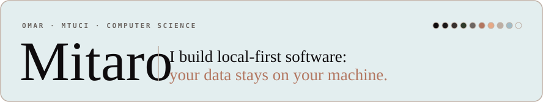
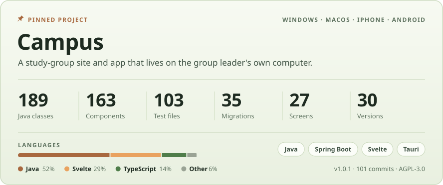
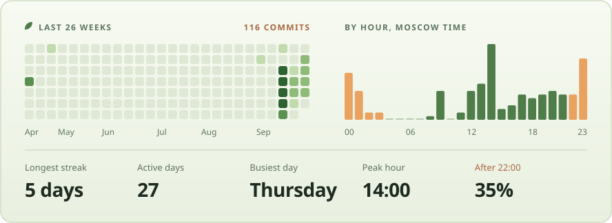
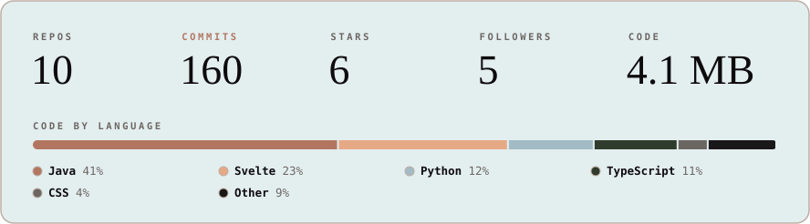
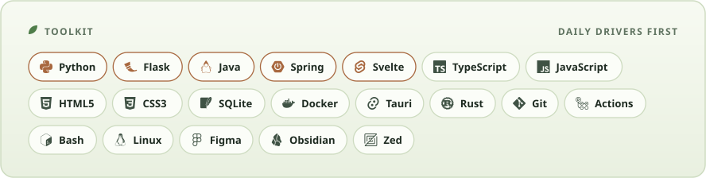
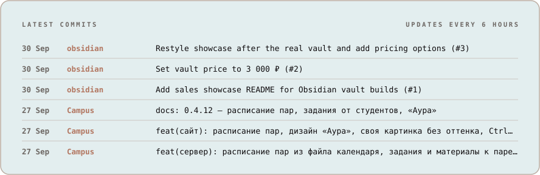

<picture><source media="(prefers-color-scheme: dark)" srcset="assets/header-dark.svg"></picture>

I'm **Omar**, online **Mitaro**, a computer science student at **MTUCI**. I write `Java` with Spring Boot, `Svelte`, `Python` and `Flask`, and I lean on one idea: **local-first**. The data stays on a machine you control, not on someone else's servers. Right now I'm digging into backend architecture and security: encryption, hashing, storing passwords properly.

[Telegram](https://t.me/treadways) · [Email](mailto:miri.saro@bk.ru) · [Instagram](https://instagram.com/stere.os)

<a href="https://github.com/mitaro-cs/Campus"><picture><source media="(prefers-color-scheme: dark)" srcset="assets/pinned-dark.svg"></picture></a>

Homework, schedule from an `.ics` file, news and files for one study group. It works offline, keeps files encrypted on disk with AES-256-GCM, signs in with passkeys and syncs when the host computer is back on.

<b>Run Campus</b>

1. Download the installer from the [latest release](https://github.com/mitaro-cs/Campus/releases/latest): `macos-apple-silicon.dmg`, `macos-intel.dmg` or `windows-setup.exe`.
2. Install it. The app is not signed, so the system asks once: on macOS use System Settings → Privacy & Security → Open Anyway, on Windows More info → Run anyway.
3. On the first launch enter the group name, your name and a password: you become the admin and the group leader.
4. Management → Server → CloudPub → Open access gives a permanent link and a QR code for the group.

Classmates open the link, sign in and add the site to their home screen as an app.

<picture><source media="(prefers-color-scheme: dark)" srcset="assets/activity-dark.svg"></picture>

<picture><source media="(prefers-color-scheme: dark)" srcset="assets/numbers-dark.svg"></picture>

<picture><source media="(prefers-color-scheme: dark)" srcset="assets/stack-dark.svg"></picture>

<picture><source media="(prefers-color-scheme: dark)" srcset="assets/commits-dark.svg"></picture>

Also in my repositories: [VantaVault](https://github.com/mitaro-cs/VantaVault), a private vault for external drives; [AetherCloud](https://github.com/mitaro-cs/AetherCloud), your own disk as a private cloud; [Kworking](https://github.com/mitaro-cs/KworkingSystem), a booking panel for a campus coworking space; and [Mouros](https://github.com/mitaro-cs/Mouros), my Python practice archive.

The cards are drawn by a Python script in <code>/scripts</code> in park colours and refreshed by GitHub Actions every six hours.
