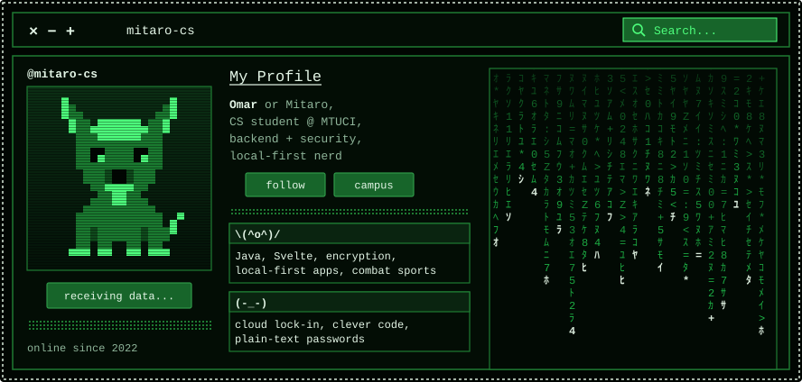
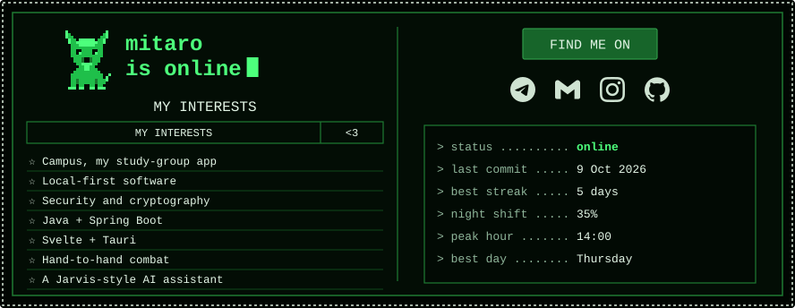
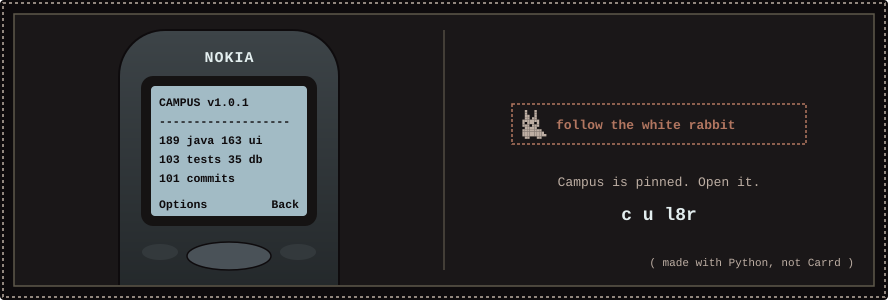
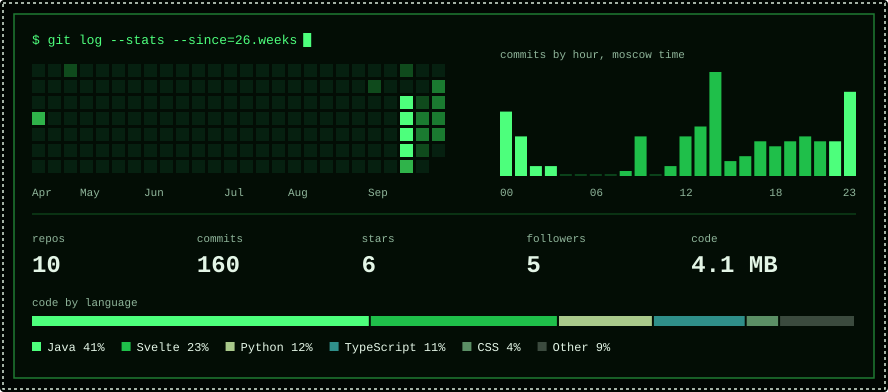

[telegram](https://t.me/treadways) · [email](mailto:miri.saro@bk.ru) · [instagram](https://instagram.com/stere.os) · [campus](https://github.com/mitaro-cs/Campus)

**Campus** is a study-group site and app that lives on the group leader's own computer: homework, a schedule from an `.ics` file, news and files. It works offline, keeps files encrypted with AES-256-GCM and signs in with passkeys.

<b>Run Campus</b>

1. Download the installer from the [latest release](https://github.com/mitaro-cs/Campus/releases/latest): `macos-apple-silicon.dmg`, `macos-intel.dmg` or `windows-setup.exe`.
2. Install it. The app is not signed, so the system asks once: on macOS use System Settings → Privacy & Security → Open Anyway, on Windows More info → Run anyway.
3. On the first launch enter the group name, your name and a password: you become the admin and the group leader.
4. Management → Server → CloudPub → Open access gives a permanent link and a QR code for the group.

Classmates open the link, sign in and add the site to their home screen as an app.

