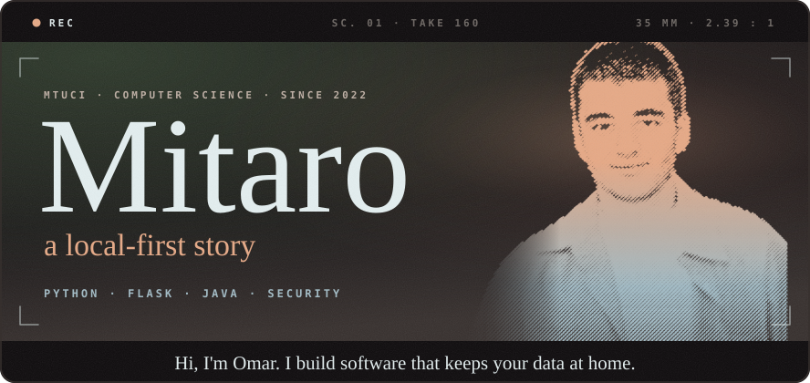
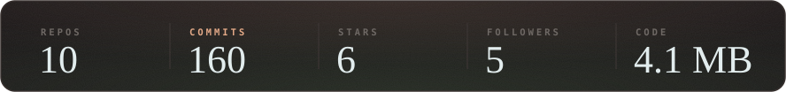
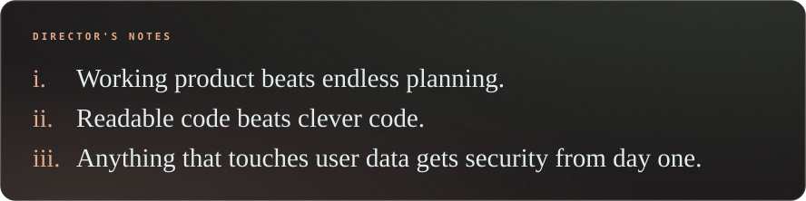
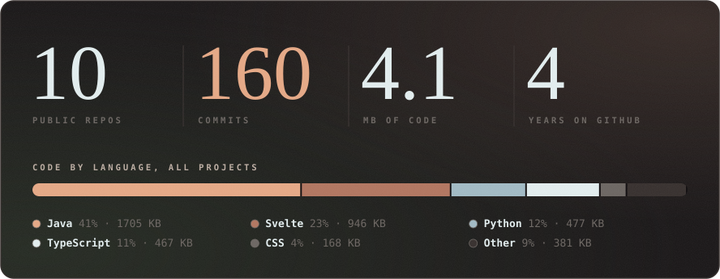
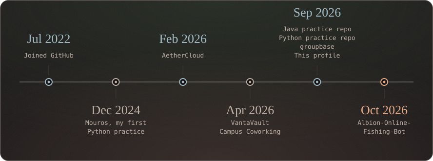
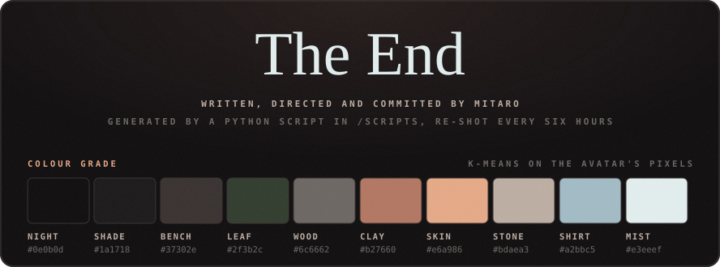

<div align="center">




</div>


I'm **Omar**, and online I go by **Mitaro**. I study computer science at **MTUCI**. I started with `Python` and `Flask`, and lately I also write `Java` with Spring Boot and `Svelte` for bigger projects.

I lean on one idea: **local-first**. The data stays on a machine you control instead of a cloud service in the middle. That's why I reach for `SQLite` and the local disk before I reach for someone else's servers.

Right now I'm getting better at backend architecture and at the security side of things: encryption, hashing, how to store a password properly. On the side I'm prototyping a personal AI assistant in the spirit of Jarvis, mostly to see how far I can push it.

Outside of code I train hand-to-hand combat. The habit of keeping a cold head under pressure carries over to debugging.

<div align="center">

<a href="https://t.me/treadways"></a>
<a href="mailto:miri.saro@bk.ru"></a>
<a href="https://instagram.com/stere.os"></a>

<br><br>



</div>


<a href="https://github.com/mitaro-cs/KworkingSystem"></a>

<details>
<summary><b>How to run Campus Coworking</b></summary>

```bash
git clone https://github.com/mitaro-cs/KworkingSystem.git
cd KworkingSystem
./start_macos.command        # Windows: start_windows.bat
```

The start file creates a virtual environment, installs `requirements.txt`, opens the browser and serves the app on `http://127.0.0.1:5000`. Set `PORT=8000` to change the port.

</details>

Also in my repositories: [groupbase](https://github.com/mitaro-cs/StorageSystem), [VantaVault](https://github.com/mitaro-cs/VantaVault) and [AetherCloud](https://github.com/mitaro-cs/AetherCloud); [Mouros](https://github.com/mitaro-cs/Mouros) is my Python practice archive, and [Java](https://github.com/mitaro-cs/Java) and [Python](https://github.com/mitaro-cs/Python) hold the first steps in each language.


<sub>Every frame is a real commit from my repositories, unedited. The strip updates itself.</sub>








- Building **Java** and **Flask** backends with cleaner structure
- Studying **security**: encryption, hashing, local-first design
- Prototyping a personal **AI assistant**, Jarvis-style
- Studying computer science at **MTUCI**

<br>


