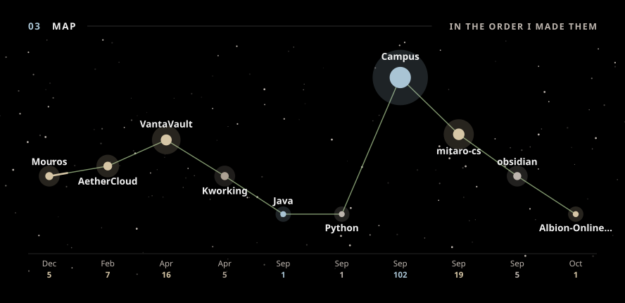
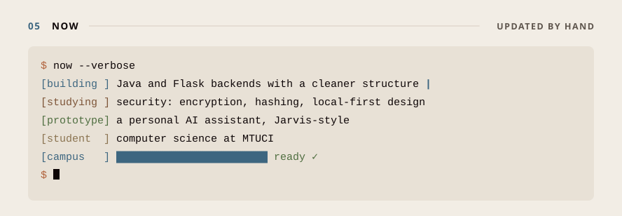

<picture><source media="(max-width: 600px) and (prefers-color-scheme: dark)" srcset="assets/cover-dark-mobile.svg"><source media="(max-width: 600px)" srcset="assets/cover-light-mobile.svg"><source media="(prefers-color-scheme: dark)" srcset="assets/cover-dark.svg"></picture>

**Contents:** [01 Campus](#campus) · [02 Rhythm](#rhythm) · [03 Map](#map) · [04 Toolkit](#toolkit) · [05 Now](#now) · [Contact](#contact)

<a href="https://github.com/mitaro-cs/Campus"><picture><source media="(max-width: 600px) and (prefers-color-scheme: dark)" srcset="assets/campus-dark-mobile.svg"><source media="(max-width: 600px)" srcset="assets/campus-light-mobile.svg"><source media="(prefers-color-scheme: dark)" srcset="assets/campus-dark.svg"></picture></a>

<b>Run Campus</b>

1. Download the installer from the [latest release](https://github.com/mitaro-cs/Campus/releases/latest): `macos-apple-silicon.dmg`, `macos-intel.dmg` or `windows-setup.exe`.
2. Install it. The app is not signed, so the system asks once: on macOS use System Settings → Privacy & Security → Open Anyway, on Windows More info → Run anyway.
3. On the first launch enter the group name, your name and a password: you become the admin and the group leader.
4. Management → Server → CloudPub → Open access gives a permanent link and a QR code for the group.

Classmates open the link, sign in and add the site to their home screen as an app.

<picture><source media="(max-width: 600px) and (prefers-color-scheme: dark)" srcset="assets/rhythm-dark-mobile.svg"><source media="(max-width: 600px)" srcset="assets/rhythm-light-mobile.svg"><source media="(prefers-color-scheme: dark)" srcset="assets/rhythm-dark.svg"></picture>

<picture><source media="(max-width: 600px) and (prefers-color-scheme: dark)" srcset="assets/map-dark-mobile.svg"><source media="(max-width: 600px)" srcset="assets/map-light-mobile.svg"><source media="(prefers-color-scheme: dark)" srcset="assets/map-dark.svg"></picture>

<picture><source media="(max-width: 600px) and (prefers-color-scheme: dark)" srcset="assets/toolkit-dark-mobile.svg"><source media="(max-width: 600px)" srcset="assets/toolkit-light-mobile.svg"><source media="(prefers-color-scheme: dark)" srcset="assets/toolkit-dark.svg"></picture>

<picture><source media="(max-width: 600px) and (prefers-color-scheme: dark)" srcset="assets/now-dark-mobile.svg"><source media="(max-width: 600px)" srcset="assets/now-light-mobile.svg"><source media="(prefers-color-scheme: dark)" srcset="assets/now-dark.svg"></picture>

**Contact:** [Telegram](https://t.me/treadways) · [Email](mailto:miri.saro@bk.ru) · [Instagram](https://instagram.com/stere.os)

**Other projects:** [VantaVault](https://github.com/mitaro-cs/VantaVault), a private vault for external drives · [AetherCloud](https://github.com/mitaro-cs/AetherCloud), your own disk as a private cloud · [Kworking](https://github.com/mitaro-cs/KworkingSystem), a booking panel for a campus coworking space · [Mouros](https://github.com/mitaro-cs/Mouros), my Python practice archive

The pages are built by a Python script in <code>/scripts</code> from the GitHub API and refreshed every six hours. The motion stops if your system asks for reduced motion.
